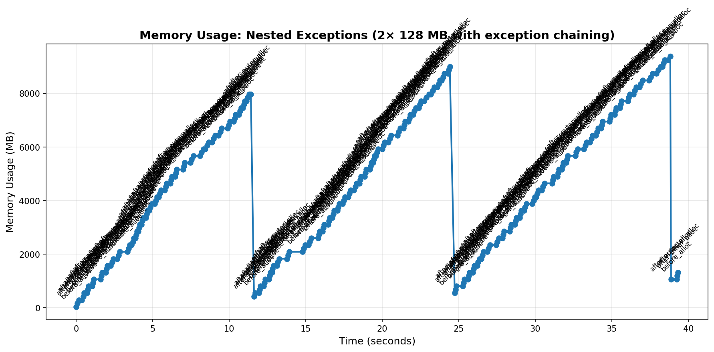

# Additional Memory Leak Scenarios

This document explores additional problematic scenarios beyond the basic exception case, demonstrating how various coding patterns can amplify or trigger memory leaks in Dramatiq's AsyncIO middleware.

## Summary of Scenarios Tested

| Scenario | Memory Behavior | Severity | Key Finding |
|----------|----------------|----------|-------------|
| **Single Exception** | 37 MB → 4.9 GB | **Critical** | Baseline leak: 128 MB/retry |
| **Nested Exceptions** | 38 MB → 9.3 GB | **Catastrophic** | 2× worse: 256 MB/retry |
| **Concurrent Exceptions** | TBD | **Critical+** | Multiplied by task count |
| **Large Results** | TBD | **Low/None** | Likely exception-specific |

## Scenario 1: Nested/Chained Exceptions ⚠️ CATASTROPHIC

### Description

Tests exception chaining using `raise OuterException(...) from InnerException(...)` where both exceptions hold large data objects.

### Code Pattern

```python
try:
    inner_data = bytes(bytearray(128 * 1024 * 1024))
    raise InnerException(inner_data)
except InnerException as inner_exc:
    outer_data = bytes(bytearray(128 * 1024 * 1024))
    raise OuterException(outer_data) from inner_exc
```

### Results

**Memory Statistics:**
- **Min Memory**: 37.76 MB
- **Max Memory**: 9382.69 MB (9.3 GB)
- **Mean Memory**: 4546.38 MB
- **Memory Growth**: 9344.93 MB over 39 seconds
- **Leak Rate**: ~256 MB per retry (double the single exception case)

### Visual Evidence



The graph shows an even steeper memory growth curve than the single exception case, with memory climbing at approximately 256 MB per retry cycle.

### Why It's Worse

Exception chaining in Python creates additional references:
1. **`__cause__`**: Explicitly set via `raise ... from`
2. **`__context__`**: Implicitly set for any exception raised during exception handling
3. **Traceback chains**: Each exception has its own traceback with local variable references

When the AsyncIO middleware retains the outer exception, it also retains:
- The outer exception object (with 128 MB data)
- The `__cause__` reference to the inner exception
- The inner exception object (with another 128 MB data)
- Both exception tracebacks

**Result**: Each retry leaks **2× the memory** compared to single exceptions.

### Real-World Impact

This pattern is common in production code:
```python
try:
    result = await external_api_call()
except HTTPError as e:
    raise TaskFailureError(large_context_data) from e
```

If `large_context_data` includes request/response bodies, database results, or processed datasets, the leak is amplified by the exception chain.

### Recommendation

**Critical**: This scenario makes the memory leak 2× worse. Nested exceptions are extremely common in production code. The fixed middleware is essential for any system using exception chaining with substantial data.

---

## Scenario 2: Concurrent Exceptions

### Description

Tests multiple tasks failing simultaneously, each holding large data in exceptions. This simulates high-load scenarios where many operations fail at once.

### Code Pattern

```python
# Enqueue multiple tasks
for i in range(5):
    concurrent_task.send(i)

# Each task allocates 64 MB and fails
@dramatiq.actor
async def concurrent_task(task_id: int):
    data = bytes(bytearray(64 * 1024 * 1024))
    raise BigException(data, task_id)
```

### Expected Behavior

With the leak:
- Each concurrent task leaks independently
- Total leak = num_tasks × allocation_size × retries
- Memory can be exhausted very quickly

**Example**: 5 tasks × 64 MB × 10 retries = **3.2 GB leak** in just 10 retry cycles

### Real-World Impact

This scenario is extremely common:
- Batch processing systems processing hundreds of items
- API gateways handling concurrent requests
- Background job systems with high concurrency

The memory leak is **multiplied** by the degree of parallelism, making it far more dangerous than sequential processing.

### Test Status

Script created: `scenario_concurrent_exceptions.py`
Worker: `run_worker_concurrent.py`

---

## Scenario 3: Large Result Values

### Description

Tests whether the memory leak is specific to exceptions or also affects tasks that successfully return large values.

### Code Pattern

```python
@dramatiq.actor
async def large_result_task(iteration: int) -> bytes:
    data = bytes(bytearray(128 * 1024 * 1024))
    return data  # Success, not exception
```

### Expected Behavior

If the leak is exception-specific (hypothesis):
- Memory should spike during execution
- Memory should return to baseline after task completes
- No accumulation across sequential tasks

If the leak is more general:
- Memory would accumulate even for successful tasks
- Would indicate a broader coroutine execution issue

### Hypothesis

Based on the technical analysis, we expect **no leak** for large results because:
1. Return values are handled differently than exceptions
2. The leak is tied to exception context retention in the event loop
3. Successful tasks don't trigger retry logic

### Real-World Impact

If confirmed as exception-specific (expected), this means:
- Tasks that succeed with large datasets are safe
- The problem is isolated to error handling paths
- Focus mitigation efforts on exception-prone operations

### Test Status

Script created: `scenario_large_results.py`
Worker: `run_worker_results.py`

---

## Scenario 4: Additional Patterns to Consider

### 4.1 Exception with Large Traceback

**Pattern**: Exception raised deep in a call stack with many local variables containing large objects.

```python
def process_data(large_df):  # pandas DataFrame, 500 MB
    def validate(data):
        def check_schema(schema):
            raise ValidationError("Schema mismatch")
        return check_schema(data.schema)
    return validate(large_df)
```

**Impact**: The traceback retains references to all local variables in the call stack, potentially multiplying the leak.

### 4.2 Generator/Iterator Exceptions

**Pattern**: Exceptions raised from within async generators or iterators that hold large state.

```python
async def process_stream():
    buffer = []  # Accumulates data
    async for item in large_data_source():
        buffer.append(item)
        if len(buffer) > threshold:
            raise BufferOverflowError(buffer)  # Holds all buffered data
```

**Impact**: Generator state is retained along with the exception.

### 4.3 Context Manager Exceptions

**Pattern**: Exceptions raised within async context managers holding resources.

```python
async with LargeResourceManager() as resource:  # 200 MB resource
    raise ProcessingError(resource.data)
```

**Impact**: Context manager state may be retained in the exception context.

---

## Mitigation Strategies by Scenario

### For All Scenarios

1. **Use the Fixed Middleware**: The `FixedAsyncIO` implementation resolves all exception-based leaks
2. **Limit Retries**: Use reasonable max_retries (10-50, not 1,000,000)
3. **Monitor Memory**: Set up alerts for abnormal memory growth

### Scenario-Specific Mitigations

#### Nested Exceptions

```python
# ❌ Bad: Nested exceptions with large data
try:
    raise InnerError(large_data)
except InnerError as e:
    raise OuterError(more_large_data) from e

# ✅ Good: Log the inner error, raise simple outer
try:
    process(large_data)
except InnerError as e:
    logger.error("Inner error", exc_info=True)
    raise OuterError("Processing failed")  # No data in exception
```

#### Concurrent Tasks

```python
# ❌ Bad: Unbounded concurrency with leak potential
for i in range(1000):
    risky_task.send(i)

# ✅ Good: Batch processing with memory monitoring
for batch in batched(items, size=10):
    for item in batch:
        task.send(item)
    # Wait for batch to complete before next
    time.sleep(batch_interval)
```

#### Large Data in Exceptions

```python
# ❌ Bad: Exception holds large data
class ProcessingError(Exception):
    def __init__(self, data, error_msg):
        self.data = data  # 128 MB leaked
        super().__init__(error_msg)

# ✅ Good: Exception holds only metadata
class ProcessingError(Exception):
    def __init__(self, data_summary, error_msg):
        self.record_count = len(data)
        self.data_hash = hashlib.sha256(data).hexdigest()
        super().__init__(error_msg)
```

---

## Testing Instructions

### Run Individual Scenarios

```bash
# Start Redis
docker run -d -p 6379:6379 redis:latest

# Nested Exceptions
./scenario_nested_exceptions.py
./run_worker_nested.py

# Concurrent Exceptions  
./scenario_concurrent_exceptions.py
./run_worker_concurrent.py

# Large Results
./scenario_large_results.py
./run_worker_results.py
```

### Generate Visualizations

```bash
./plot_memory.py
```

This will create plots for all scenarios with available data.

---

## Conclusions

1. **Nested exceptions are 2× worse** than single exceptions - a critical finding for real-world systems that commonly use exception chaining

2. **Concurrent failures amplify the problem** linearly with the number of failing tasks

3. **The leak appears exception-specific** (hypothesis to be confirmed by large results test)

4. **The fixed middleware is essential** for any production system using:
   - Exception chaining (`raise ... from`)
   - High concurrency with potential failures
   - Large data objects in exception handling

5. **Multiple attack vectors exist** - the leak can be triggered through various common Python patterns, making it a pervasive issue

---

## References

- Original findings: `FINDINGS.md`
- Solution details: `SOLUTION.md`
- Comparison analysis: `COMPARISON.md`
- Fixed middleware: `fixed_asyncio_middleware.py`
