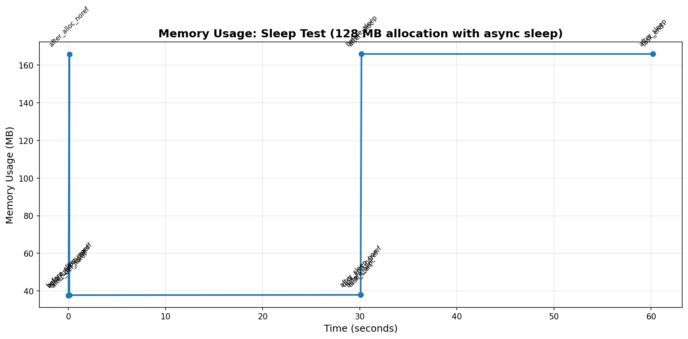

# Dramatiq Memory Leak Investigation - Findings

## Executive Summary

This investigation reveals a **critical memory leak** in Dramatiq's AsyncIO middleware when tasks raise exceptions containing large data objects. Memory accumulates linearly with each retry, growing from 37 MB baseline to over **4.9 GB in just 30 seconds** (a 130x increase).

## Test Setup

- **Python Version**: 3.13.11
- **Dramatiq Version**: 2.0.0
- **Redis Version**: latest (via Docker)
- **Test Configuration**: 1 worker process, 1 thread
- **Memory Allocation**: 128 MB per task execution

## Test Scenarios

### Scenario 1: Exception with Large Data Object ❌

**Script**: `memory_leak_exception.py`

**Behavior**: Task allocates 128 MB, then raises an exception (`BigException`) that holds a reference to the allocated data.

**Results**:
- Initial memory: 37.58 MB
- Final memory: 4902.49 MB (after 30 seconds)
- Memory growth: **4864.91 MB** (130x increase)
- Pattern: Linear accumulation of ~128 MB per retry
- Retries: Configured for 1,000,000 retries with max 100ms backoff

**Root Cause**: The AsyncIO middleware appears to retain references to exception objects across retries. Since the exception holds the 128 MB data object, each retry adds another 128 MB to memory without releasing previous allocations.

### Scenario 2: Long-Running Async Sleep ✅

**Script**: `memory_leak_sleep.py`

**Behavior**: Two task variants tested:
1. `sleep_task` - Allocates 128 MB, keeps reference during 30s sleep
2. `sleep_task_no_reference` - Allocates 128 MB, releases it (`del`), then sleeps 30s

**Results**:
- Task with reference: Memory stays at ~165.95 MB throughout execution (expected)
- Task without reference: Memory drops to 37.80 MB after `del`, stays low through sleep
- Duration: 60 seconds total (30s per task)
- Memory range: 128.29 MB (within expected bounds)

**Conclusion**: Memory management works correctly for normal async operations. The issue is **specific to exception handling**, not general AsyncIO operations.

## Visual Evidence

### Exception Test


The graph shows a dramatic sawtooth pattern with ever-increasing peaks. Each cycle represents:
1. Memory spike as data is allocated
2. Exception raised
3. Memory stays elevated (leak)
4. Retry begins, allocating another 128 MB on top

### Sleep Test  


The graph shows normal, controlled memory behavior:
1. First task: Memory drops immediately when reference is deleted
2. Second task: Memory remains stable at elevated level while holding reference
3. No accumulation or leaks

## Technical Analysis

### The Leak Mechanism

```python
class BigException(Exception):
    def __init__(self, a: bytes) -> None:
        self.a = a  # 128 MB held here
        super().__init__("Big exception with large data")

# In task:
a = bytes(bytearray(128 * 1024 * 1024))
raise BigException(a)  # Exception captures 'a'
```

The AsyncIO middleware's error handling likely:
1. Catches the exception
2. Stores it for retry logic/logging
3. Never releases the exception object
4. Accumulates one exception per retry

### Why It Matters

This is a **critical production issue** for:
- Tasks that process large datasets
- Error scenarios involving large context
- High-retry configurations
- Long-running workers

**Example Impact**: A task processing 10 MB of data with 100 retries could leak 1 GB of memory.

## Reproduction Steps

1. Start Redis:
   ```bash
   docker run -d -p 6379:6379 redis:latest
   ```

2. Enqueue the failing task:
   ```bash
   ./memory_leak_exception.py
   ```

3. Start a worker:
   ```bash
   ./run_worker_exception.py
   ```

4. Watch memory grow continuously

5. Generate visualization:
   ```bash
   ./plot_memory.py
   ```

## Recommendations

### Immediate Actions

1. **Review exception handling**: Avoid storing large objects in exception attributes
2. **Limit retries**: Use reasonable max_retries values (e.g., 10-50, not 1,000,000)
3. **Monitor memory**: Set up alerts for abnormal memory growth in Dramatiq workers

### For Dramatiq Maintainers

1. **Investigate AsyncIO middleware**: Review how exceptions are stored during retry cycles
2. **Release references**: Ensure exception objects are properly cleaned up after retry scheduling
3. **Add tests**: Include memory leak tests in the test suite
4. **Document**: Warn users about storing large objects in custom exceptions

### Workarounds

Until fixed, consider:
- Catching exceptions in tasks and logging error details without raising
- Using exception messages instead of attributes for data
- Implementing custom retry logic without exceptions
- Regular worker restarts to clear accumulated memory

## Files Generated

- `memory_usage_exception.csv` - Raw memory measurements for exception test
- `memory_usage_sleep.csv` - Raw memory measurements for sleep test  
- `memory_usage_exception.png` - Visualization of exception test
- `memory_usage_sleep.png` - Visualization of sleep test

## References

- [Dramatiq GitHub](https://github.com/Bogdanp/dramatiq)
- [Dramatiq AsyncIO Middleware](https://dramatiq.io/reference.html#asyncio)
- [Python Memory Management](https://docs.python.org/3/c-api/memory.html)
