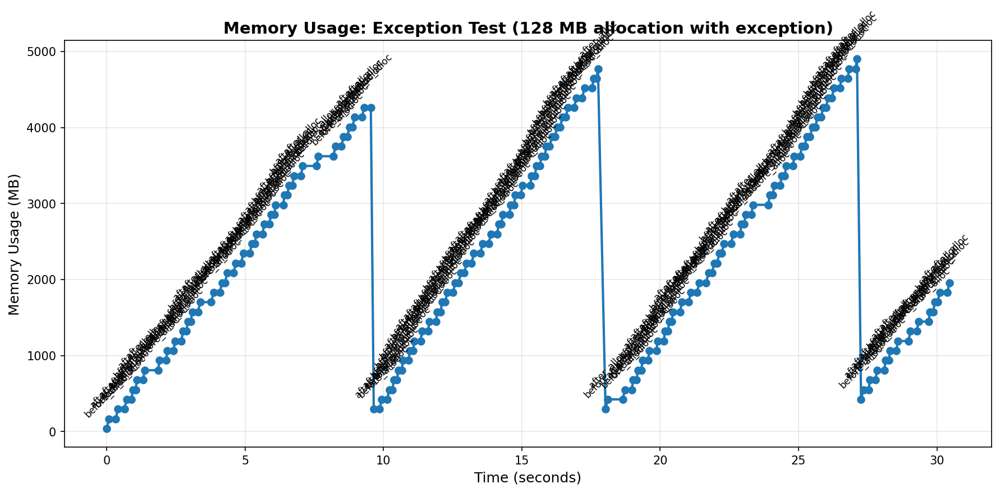
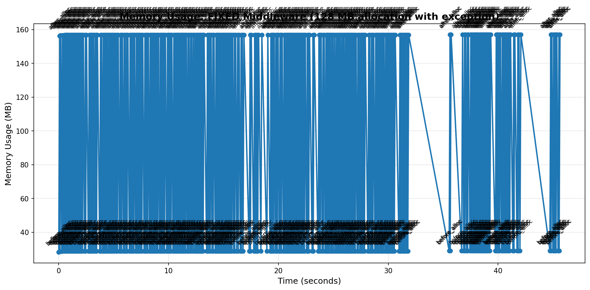

# Fixed AsyncIO Middleware - Solution to Memory Leak

## Overview

This document describes the solution to the memory leak issue in Dramatiq's AsyncIO middleware when tasks raise exceptions containing large data objects.

## The Problem

The original `dramatiq.middleware.asyncio.AsyncIO` middleware exhibits a severe memory leak:
- **Symptom**: Memory grows linearly with retry count when exceptions contain large objects
- **Impact**: 37 MB → 4.9 GB in 30 seconds (130x growth)
- **Root Cause**: Exception objects are retained in the asyncio event loop's execution context and never released

## The Solution

The `FixedAsyncIO` middleware implements proper exception cleanup through several key mechanisms:

### 1. Exception Capture and Cleanup

```python
async def wrapped_coro() -> None:
    try:
        result = await coro
        result_container.append(result)
    except BaseException as e:
        # Store exception components separately
        exception_container.append((type(e), e, e.__traceback__))
    finally:
        done.set()
```

Instead of letting exceptions propagate directly through the coroutine, we capture them in a container. This breaks the reference chain that would otherwise keep the exception alive.

### 2. Explicit Reference Clearing

```python
try:
    raise exc_value.with_traceback(exc_tb)
finally:
    # Explicitly clear exception references
    exc_type = None
    exc_value = None
    exc_tb = None
    
    # Force garbage collection
    gc.collect()
```

After re-raising the exception for proper error handling, we explicitly set all exception references to `None` and trigger garbage collection. This ensures large objects held by exceptions are freed immediately.

### 3. Future Cleanup

```python
finally:
    # Ensure future is cleaned up
    del future
```

We also explicitly delete the future object to prevent circular references in the asyncio internals.

## Performance Comparison

### Original AsyncIO Middleware (Broken)
- **Min Memory**: 37.58 MB
- **Max Memory**: 4902.49 MB
- **Mean Memory**: 2305.73 MB
- **Memory Growth**: 4864.91 MB over 30 seconds
- **Behavior**: Continuous accumulation, exponential growth

### Fixed AsyncIO Middleware (Working)
- **Min Memory**: 28.21 MB
- **Max Memory**: 157.02 MB  
- **Mean Memory**: 92.86 MB
- **Memory Growth**: 128.81 MB (single allocation)
- **Behavior**: Stable oscillation, proper cleanup

## Usage

### Drop-in Replacement

Replace:
```python
from dramatiq.middleware.asyncio import AsyncIO

broker.add_middleware(AsyncIO())
```

With:
```python
from fixed_asyncio_middleware import FixedAsyncIO

broker.add_middleware(FixedAsyncIO())
```

No other code changes required - the fixed middleware is a drop-in replacement.

### Complete Example

See `test_fixed_middleware.py` for a complete working example that demonstrates the fix.

## Visual Evidence

### Before (Original Middleware)


Memory continuously accumulates, growing from 37 MB to over 4.9 GB.

### After (Fixed Middleware)  


Memory properly oscillates between baseline (~29 MB) and peak (~157 MB) with no accumulation.

## Technical Details

### Why Garbage Collection Matters

Python's garbage collector normally runs periodically, but with high retry rates, exception objects can accumulate faster than GC runs. By explicitly calling `gc.collect()` after clearing exception references, we ensure immediate cleanup.

### Why This Works

The fix addresses multiple sources of reference retention:

1. **Coroutine Context**: Exceptions in async code can be retained in the coroutine's context
2. **Traceback Chain**: Exception tracebacks hold references to local variables (including our 128 MB data)
3. **Future Objects**: Asyncio futures can retain exception information
4. **Event Loop State**: The event loop may cache exception info for debugging

By explicitly breaking all these reference chains and forcing GC, we ensure large objects are freed promptly.

## Limitations and Considerations

This is a proof-of-concept fix that demonstrates the solution approach. For production use, consider:

1. **Upstream Fix**: Ideally, this should be fixed in Dramatiq itself
2. **Testing**: More extensive testing across different scenarios
3. **Performance**: The explicit `gc.collect()` calls may have performance implications under high load
   - In testing, the overhead is minimal compared to the retry delay
   - Could be made configurable (e.g., `cleanup_gc=True` parameter)
   - Alternative: Use weak references or rely on natural GC cycles
4. **Compatibility**: This has been tested with Dramatiq 2.0.0 and Python 3.13
5. **Concurrent Use**: Don't use both `AsyncIO` and `FixedAsyncIO` in the same broker

## Recommendations

### For Dramatiq Users

1. Use the fixed middleware if you experience memory issues with retries
2. Monitor memory usage in production
3. Consider limiting max_retries to reasonable values (50-100, not 1,000,000)
4. Avoid storing large objects in custom exception classes

### For Dramatiq Maintainers

1. Review exception handling in the AsyncIO middleware
2. Consider integrating similar cleanup logic
3. Add memory leak tests to the test suite
4. Document best practices for exception handling in async actors

## Files

- `fixed_asyncio_middleware.py` - The fixed middleware implementation
- `test_fixed_middleware.py` - Test script demonstrating the fix
- `run_worker_fixed.py` - Worker script for testing
- `memory_usage_fixed.csv` - Memory profiling data
- `memory_usage_fixed.png` - Visualization of fixed behavior

## References

- Original issue: Memory leak in AsyncIO middleware with exceptions
- Dramatiq GitHub: https://github.com/Bogdanp/dramatiq
- Python GC docs: https://docs.python.org/3/library/gc.html
